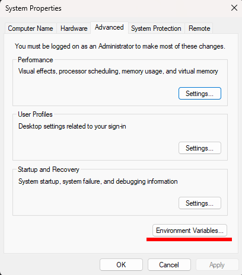
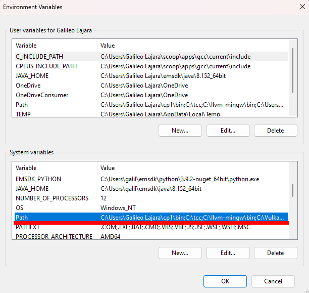

# Installation

## Step 1: Download Cp1
Either 1) Unzip the file from GitHub: [cp1-main.zip](https://github.com/galileolajara/cp1/archive/refs/heads/main.zip). Or 2) Clone the git repository by entering the command below:
```
git clone --depth 1 https://github.com/galileolajara/cp1
```

## Step 2: On Windows
Binaries are pre-built and located at the `bin` folder as `cp1-*.exe`. No compilation necessary on Windows. Just update your `PATH` environment variable to make the `cp1-*.exe` binaries available in your command prompt by following the steps below:
- On the **search bar** beside the *Start Menu*, type "Edit the system environment variables".

- Click the `Environment Variables...` button below and near the *Ok, Cancel, Apply* buttons.

- Double click the `Path` under `System variables` list.

- Click the `New` button, then click `Browse`.
- Locate the path from the **Step 1 above** where cp1 is located. If your `cp1-compile.exe` is on `C:\cp1\bin\cp1-compile.exe`, choose `C:\cp1`
- Click `Ok` three times. You need to *restart your computer* for these changes to take effect.

- The `cp1-run.exe` requires either one of the three compilers to be present at `PATH` environment variable: `tcc`, `clang` or `gcc`.
- Open a command prompt and type:
```
tcc
clang
gcc
```
- If all of the commands above *is not recognized as an internal or external command*, you need to install one of the three.
- The simplest to install is TCC. Unzip [tcc.zip](http://download.savannah.gnu.org/releases/tinycc/tcc-0.9.27-win64-bin.zip) to `C:\` so that there will be `C:\tcc\tcc.exe`.
- Repeat the steps above to update the `PATH` environment variable again but choose `C:\tcc` when locating the path after clicking the `Browse` button.
- After restarting your computer the following commands should be recognized when you type them in the command prompt:
```
cp1-run
tcc
```

## Step 2: On Linux, macOS, and BSD
- On your terminal, go to the path where cp1 was downloaded from the **Step 1 above**.
```
cd ~/cp1 # Assuming that cp1 was downloaded to your home folder

# Run one of the following:
make -f Makefile-clang # to build using Clang
make -f Makefile-gcc # to build using GCC
make -f Makefile-tcc # to build using TCC
```
- Add `cp1/bin` to your `PATH` environment variable. Depending on the shell you are using, instructions differ. Type the following to determine your shell:
```
echo $SHELL
```
- If your `$SHELL` is `bash`, edit `.bashrc` on your home directory and **add one line** above "export PATH":
```
... some codes here ...
PATH=~/cp1/bin:"$PATH" # ADD ONLY THIS ONE LINE
export PATH
... some codes here ...
```
- If your `$SHELL` is `zsh`, edit `.zshrc` on your home directory and follow the editing of code in `bash` above.
